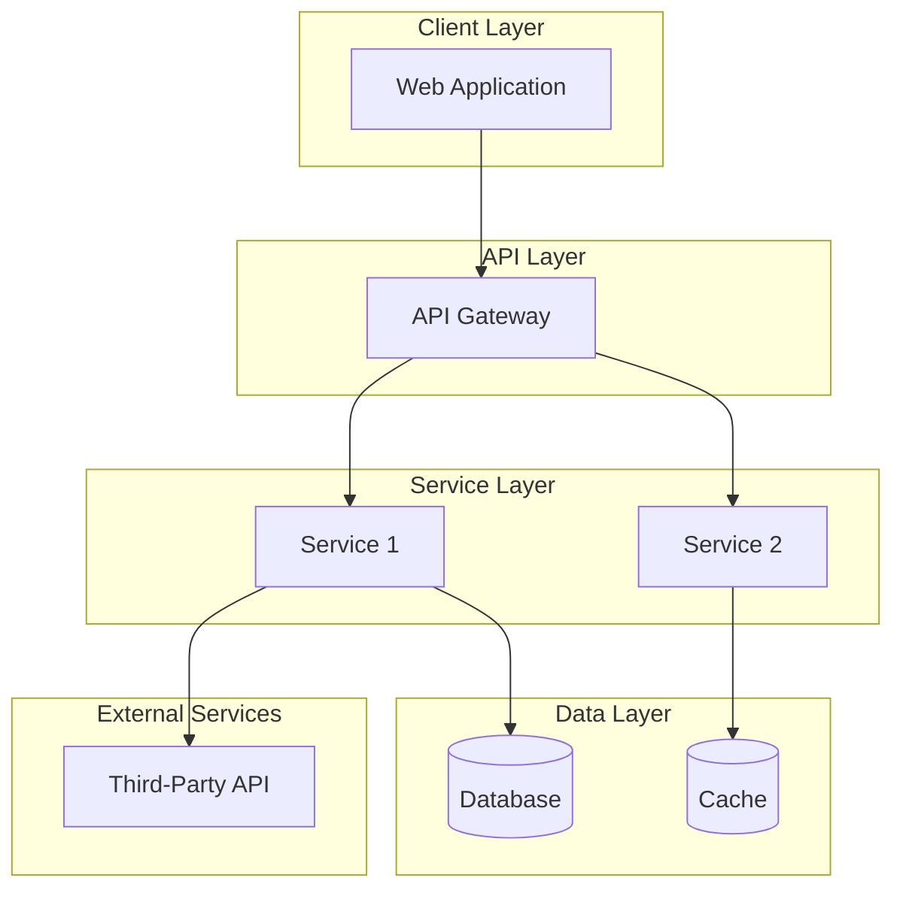
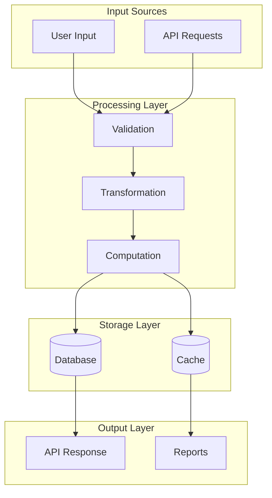
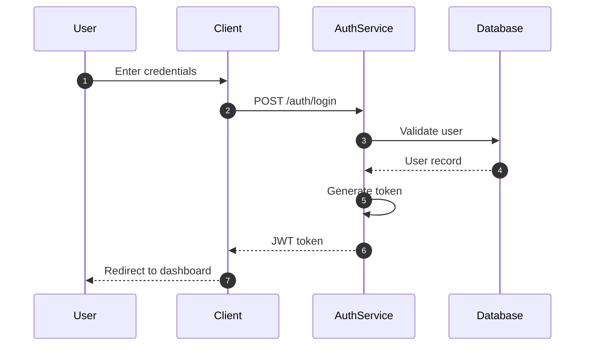
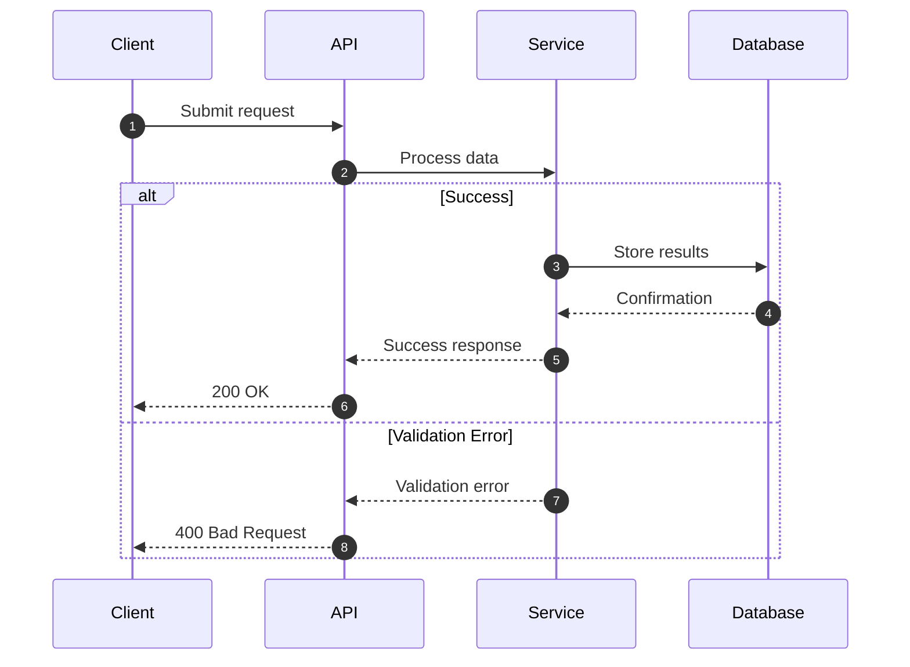
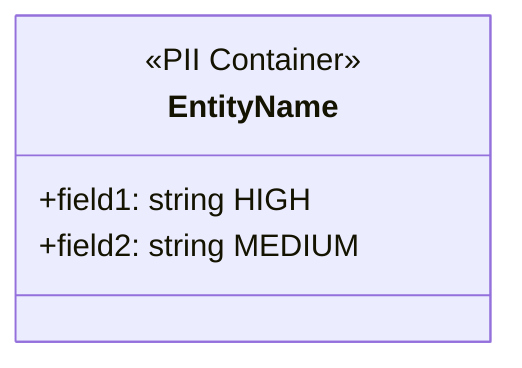
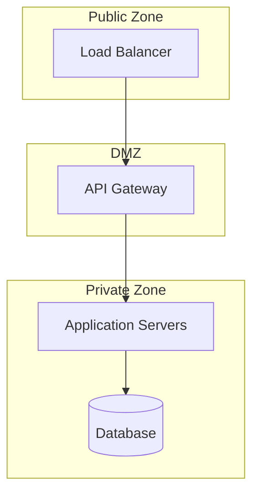
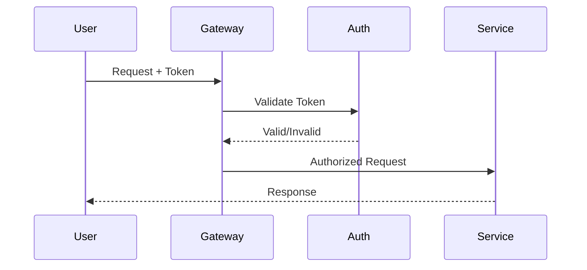
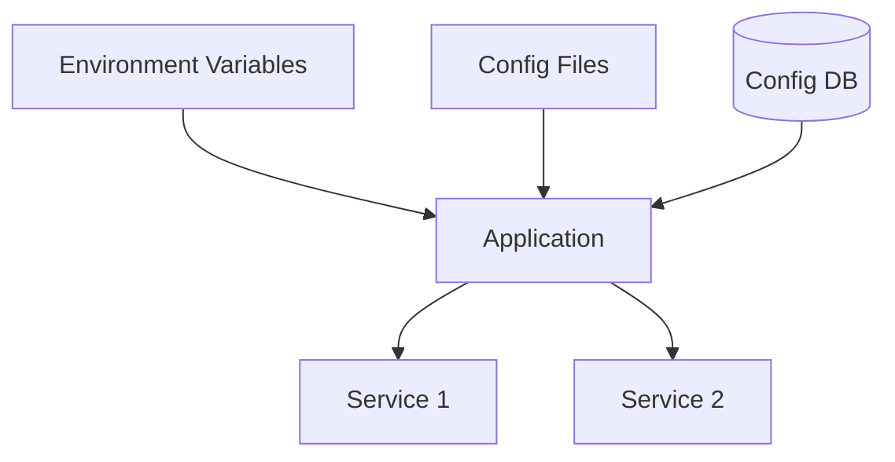

# Core Document Templates

Templates for the 9 core documentation files. Adapt structure to the actual repository — replace all bracketed placeholders with real content.

---

## 1. ARCHITECTURE.md

```markdown
# [Project Name] System Architecture

## Overview
[Brief description of the system and its purpose]

---

## High-Level Architecture Diagram



---

## Technology Stack

### [Layer Name]
| Component | Technology | Version |
|-----------|------------|---------|
| [Component] | [Technology] | [Version] |

---

## Service Catalog

| Service | Port | Primary Responsibilities |
|---------|------|-------------------------|
| [Service Name] | [Port] | [Description] |

---

## Deployment Architecture

[Container/deployment diagram if applicable]

```mermaid
graph TB
    [Deployment topology diagram]
```

---

## Communication Patterns

[Synchronous/asynchronous communication documentation]

---

## Version History

| Version | Date | Changes |
|---------|------|---------|
| 1.0 | [Date] | Initial documentation |
```

---

## 2. DATA_FLOW.md

```markdown
# [Project Name] Data Flow Documentation

## Overview
[How data flows through the system]

---

## High-Level Data Flow



---

## Core Data Flow Scenarios

### Scenario 1: [Name]

```mermaid
flowchart TB
    [Detailed flow for this scenario]
```

**Steps:**
1. [Step description]

**Error handling:**
- [Error scenario and handling]

### Scenario 2: [Name]
[Repeat — minimum 3 scenarios]

---

## Data Transformation Pipeline

| Stage | Input | Transformation | Output |
|-------|-------|----------------|--------|
| [Stage] | [Input format] | [Transform] | [Output format] |

---

## Integration Data Flows

[External system data flows with diagrams]

---

## Version History

| Version | Date | Changes |
|---------|------|---------|
| 1.0 | [Date] | Initial documentation |
```

---

## 3. SEQUENCE_DIAGRAMS.md

```markdown
# [Project Name] Sequence Diagrams

## Overview
[Brief description of diagrams included]

---

## 1. Authentication Flow



## 2. Primary User Workflow



## 3. Data Creation/Modification Flow
[Sequence diagram with autonumber]

## 4. Background Processing Flow
[Sequence diagram with autonumber]

## 5. Error Handling Flow
[Sequence diagram with autonumber, showing retry/fallback logic]

---

## Version History

| Version | Date | Changes |
|---------|------|---------|
| 1.0 | [Date] | Initial documentation |
```

---

## 4. PII_DATA.md

```markdown
# [Project Name] PII Data Documentation

## Overview
[PII handling description]

---

## PII Classification Levels

| Level | Description | Examples | Protection Requirements |
|-------|-------------|----------|------------------------|
| HIGH | Direct personal identifiers | SSN, passport, financial accounts | Encryption at rest + transit, strict access control, audit logging |
| MEDIUM | Indirect identifiers | Email, phone, address | Encryption in transit, role-based access |
| LOW | Non-sensitive personal data | Preferences, settings | Standard access controls |

---

## PII Data Inventory

### [Data Category]



| Field | Classification | Storage | Encryption | Masking |
|-------|---------------|---------|------------|---------|
| [Field] | [Level] | [Location] | [Method] | [Rule] |

---

## Data Flow Map with PII Indicators

```mermaid
flowchart TB
    [Show PII flow through system with classification labels]
```

---

## Protection Measures

### Encryption
- **At rest**: [Mechanism]
- **In transit**: [Mechanism]

### Access Controls
[Access control mechanisms]

### Data Masking Rules
| Field | Display Rule | Log Rule |
|-------|-------------|----------|
| [Field] | [Mask pattern] | [Log rule] |

### Data Retention
| Data Category | Retention Period | Disposal Method |
|--------------|-----------------|-----------------|
| [Category] | [Period] | [Method] |

---

## Compliance Requirements

| Regulation | Applicable | Requirements |
|-----------|-----------|-------------|
| GDPR | [Yes/No] | [Requirements] |
| CCPA | [Yes/No] | [Requirements] |
| HIPAA | [Yes/No] | [Requirements] |

---

## Version History

| Version | Date | Changes |
|---------|------|---------|
| 1.0 | [Date] | Initial documentation |
```

---

## 5. DATA_SECURITY.md

```markdown
# [Project Name] Data Security Documentation

## Overview
[Security architecture description]

---

## Security Architecture



---

## Authentication & Authorization

### Authentication Flow



### Role-Based Access Control

| Role | Permissions |
|------|------------|
| [Role] | [Permissions] |

### Permission Matrix

| Resource | [Role 1] | [Role 2] | [Role 3] |
|----------|----------|----------|----------|
| [Resource] | [CRUD] | [CRUD] | [CRUD] |

---

## Data Encryption

### At Rest
[Encryption at rest mechanisms]

### In Transit
[Transport layer security]

---

## Network Security

### Firewall Rules
[Key firewall rules]

---

## Application Security

### Input Validation
[Validation approach]

### Security Headers
| Header | Value | Purpose |
|--------|-------|---------|
| [Header] | [Value] | [Purpose] |

### API Security
[API security measures — rate limiting, CORS, etc.]

---

## Audit Logging

### Logged Events
| Event | Severity | Retention |
|-------|----------|-----------|
| [Event] | [Level] | [Period] |

---

## Security Checklist

- [ ] Authentication configured
- [ ] Authorization enforced
- [ ] Encryption at rest enabled
- [ ] TLS configured
- [ ] Input validation active
- [ ] Security headers set
- [ ] Audit logging enabled
- [ ] Rate limiting configured

---

## Version History

| Version | Date | Changes |
|---------|------|---------|
| 1.0 | [Date] | Initial documentation |
```

---

## 6. FEATURES_LIST.md

```markdown
# [Project Name] Features List

## Overview
[System features description]

---

## Feature Status Legend

| Status | Description |
|--------|-------------|
| IMPLEMENTED | Feature is complete |
| IN PROGRESS | Partially implemented |
| PLANNED | Planned but not started |
| NOT PLANNED | Not in roadmap |

---

## [Feature Category 1]

### [Sub-Category]

| Feature | Status | Description |
|---------|--------|-------------|
| [Feature Name] | [Status] | [Description] |

[Repeat for all categories — minimum 20 features total]

---

## Feature Roadmap Summary

### Implemented
- [List]

### In Progress
- [List]

### Planned
- [List]

---

## Version History

| Version | Date | Changes |
|---------|------|---------|
| 1.0 | [Date] | Initial documentation |
```

---

## 7. MODULES_LIST.md

```markdown
# [Project Name] Modules List

## Overview
[Module organization description]

---

## Module Architecture Overview

```mermaid
graph TB
    [Module dependency diagram]
```

---

## [Layer Name] Modules

### [Module Name]

**Package/Path:** `[path]`

| Component | File | Responsibility |
|-----------|------|----------------|
| [Component] | [File] | [Description] |

**Endpoints:**
- `[METHOD] [path]` — [Description]

---

## Module Dependencies

```mermaid
graph LR
    [Dependency diagram]
```

---

## Database Dependencies

| Module | Database | Tables |
|--------|----------|--------|
| [Module] | [DB] | [Tables] |

---

## Version History

| Version | Date | Changes |
|---------|------|---------|
| 1.0 | [Date] | Initial documentation |
```

---

## 8. CONFIGURABLE_DESIGN.md

```markdown
# [Project Name] Configurable Design Documentation

## Overview
[Configuration approach description]

---

## Configuration Architecture



---

## Configurable Components

### [Component Category]

| Parameter | Type | Default | Range/Valid Values | Description |
|-----------|------|---------|-------------------|-------------|
| [Param] | [Type] | [Default] | [Range] | [Description] |

---

## Configuration Files

### [Config File Type]

```yaml
# Example configuration
[Show example]
```

### Environment Variables

```bash
# Override via environment
[Show env var examples]
```

---

## Configuration Best Practices

- [Best practice items]

---

## Version History

| Version | Date | Changes |
|---------|------|---------|
| 1.0 | [Date] | Initial documentation |
```

---

## 9. README.md (Documentation Index)

```markdown
# [Project Name] Documentation Index

## Overview
[Welcome message and documentation description]

---

## Documentation Structure

```
docs/
+-- ARCHITECTURE.md
+-- DATA_FLOW.md
+-- SEQUENCE_DIAGRAMS.md
+-- PII_DATA.md
+-- DATA_SECURITY.md
+-- FEATURES_LIST.md
+-- MODULES_LIST.md
+-- CONFIGURABLE_DESIGN.md
+-- [Domain-specific docs]
+-- README.md
```

---

## Quick Reference Guide

### For Developers
| Document | Purpose | When to Use |
|----------|---------|-------------|
| ARCHITECTURE.md | System overview | Onboarding, design decisions |
| MODULES_LIST.md | Module details | Finding code, understanding structure |
| CONFIGURABLE_DESIGN.md | Configuration | Changing settings, deployment |
| DATA_FLOW.md | Data pipelines | Understanding data processing |
| SEQUENCE_DIAGRAMS.md | Workflow details | Debugging, feature development |

### For Security/Compliance
| Document | Purpose | When to Use |
|----------|---------|-------------|
| DATA_SECURITY.md | Security controls | Security reviews, audits |
| PII_DATA.md | PII handling | Compliance reviews, data requests |

---

## Document Summaries

### [Document Name]
[2-3 sentence summary]

[Repeat for all documents]

---

## Diagram Types Used

| Type | Used For |
|------|----------|
| flowchart | Process flows, data flows |
| sequenceDiagram | API interactions, workflows |
| graph | Architecture, module dependencies |
| classDiagram | PII containers, config classes |
| erDiagram | Entity relationships |
| stateDiagram | Workflow states |

---

## Version History

| Version | Date | Changes |
|---------|------|---------|
| 1.0 | [Date] | Initial documentation |
```
