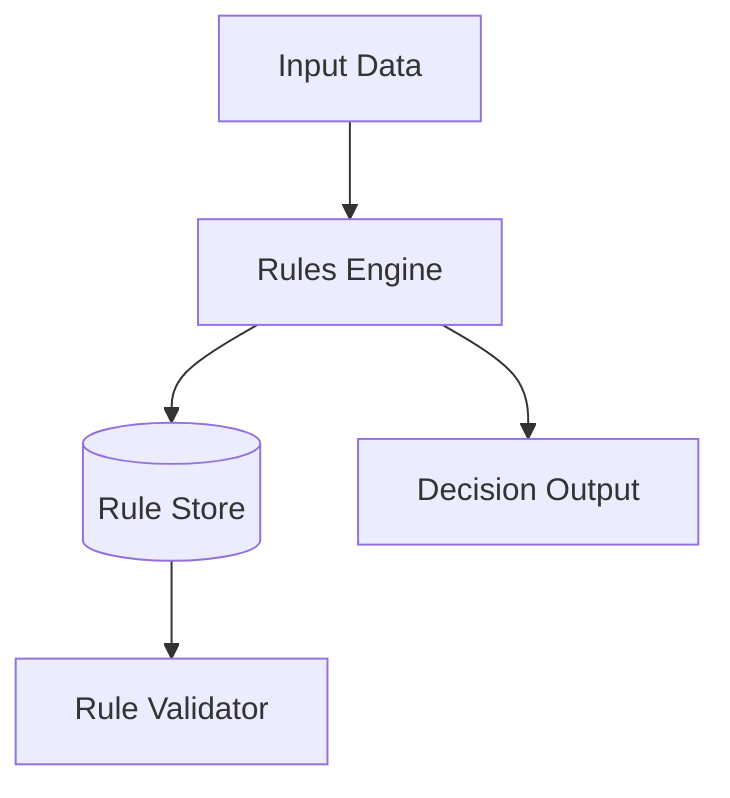
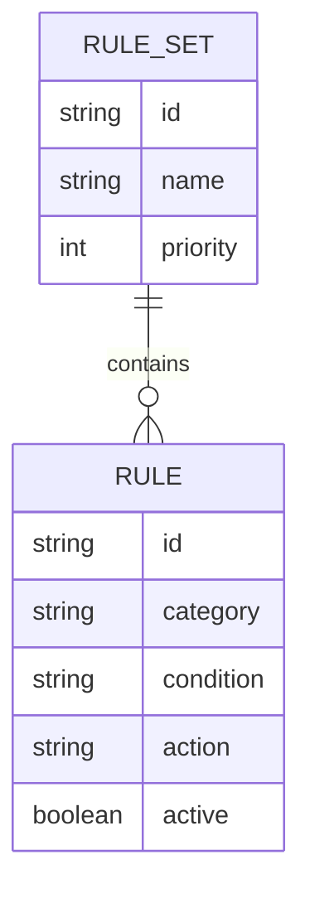
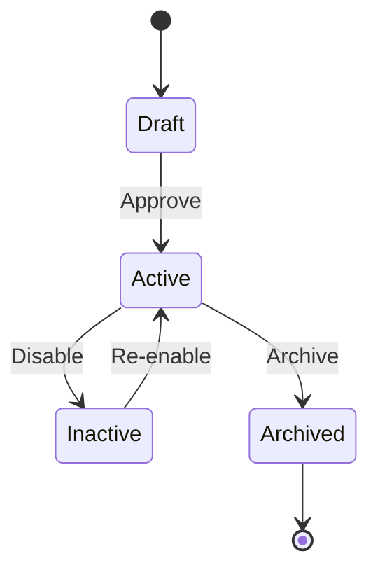
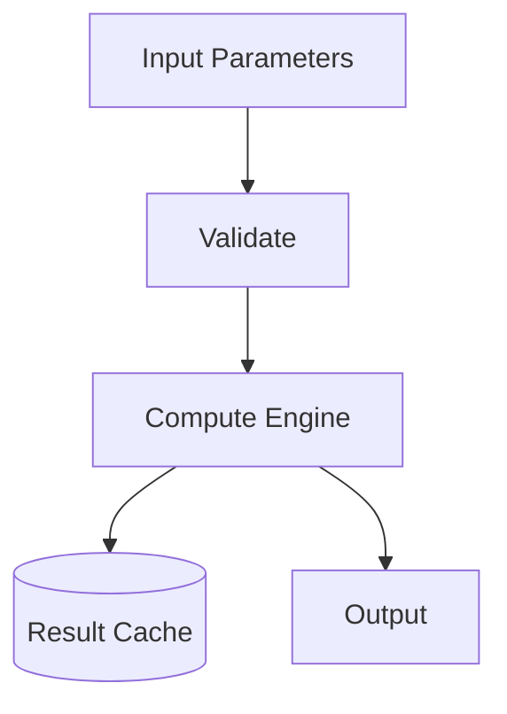

# Domain-Specific Document Templates

Generate these documents when the corresponding domain is detected during repository analysis.

---

## BUSINESS_LOGIC.md / RULE_ENGINE.md

**When to generate:** Business rules, validation engines, policy engines, workflow rules, decision tables detected.

```markdown
# [Project Name] Business Logic Documentation

## Overview
[Description of business logic/rules system]

---

## Logic Architecture



---

## Rule Categories

| Category | Description | Example Rules |
|----------|-------------|---------------|
| [Category] | [Description] | [Examples] |

---

## Rule Data Model



---

## Rule Lifecycle



---

## Built-in Rules

| Rule Code | Category | Default | Description |
|-----------|----------|---------|-------------|
| [Code] | [Category] | [Default] | [Description] |

---

## Adding Custom Rules

[How to add new rules]

---

## Rule API Reference

[Rule management APIs]

---

## Version History

| Version | Date | Changes |
|---------|------|---------|
| 1.0 | [Date] | Initial documentation |
```

---

## COMPUTATIONS.md / ALGORITHMS.md

**When to generate:** Mathematical calculations, scoring algorithms, statistical computations, financial calculations detected.

```markdown
# [Project Name] Computation Documentation

## Overview
[Description of computation/algorithm system]

---

## Computation Architecture



---

## [Computation Type] Calculation

### Calculation Flow

```mermaid
flowchart TB
    [Document calculation steps]
```

### Formula

```
[Mathematical formula or pseudocode]
```

### Example

```
Input: [values]
Step 1: [calculation]
Step 2: [calculation]
Result: [output]
```

### Configurable Parameters

| Parameter | Default | Description |
|-----------|---------|-------------|
| [Param] | [Default] | [Description] |

[Repeat for each computation type]

---

## Version History

| Version | Date | Changes |
|---------|------|---------|
| 1.0 | [Date] | Initial documentation |
```

---

## API_REFERENCE.md

**When to generate:** REST/GraphQL/gRPC APIs are the primary system interface.

```markdown
# [Project Name] API Reference

## Overview
[API description, base URL, versioning strategy]

---

## Authentication

[Auth mechanism — API keys, OAuth, JWT, etc.]

---

## Common Headers

| Header | Required | Description |
|--------|----------|-------------|
| Authorization | Yes | Bearer token |
| Content-Type | Yes | application/json |

---

## Common Response Codes

| Code | Description |
|------|-------------|
| 200 | Success |
| 400 | Bad Request |
| 401 | Unauthorized |
| 403 | Forbidden |
| 404 | Not Found |
| 500 | Internal Server Error |

---

## Endpoints

### [Resource Group]

#### [METHOD] [path]

**Description:** [What it does]

**Request:**
```json
{
  "field": "value"
}
```

**Response:**
```json
{
  "field": "value"
}
```

**Error Responses:**
| Code | Condition |
|------|-----------|
| [Code] | [When] |

[Repeat for all endpoints]

---

## Rate Limiting

[Rate limit details]

---

## Pagination

[Pagination approach]

---

## Version History

| Version | Date | Changes |
|---------|------|---------|
| 1.0 | [Date] | Initial documentation |
```

---

## DATA_MODEL.md

**When to generate:** Complex database schemas, multiple entity types, data warehouses, ETL pipelines.

```markdown
# [Project Name] Data Model Documentation

## Overview
[Data model description]

---

## Entity Relationship Diagram

```mermaid
erDiagram
    [Entity relationships]
```

---

## Entities

### [Entity Name]

**Table:** `[table_name]`

| Column | Type | Nullable | Description |
|--------|------|----------|-------------|
| [Column] | [Type] | [Yes/No] | [Description] |

**Indexes:**
| Name | Columns | Type |
|------|---------|------|
| [Name] | [Columns] | [Unique/Index] |

**Relationships:**
- [Relationship descriptions]

[Repeat for all entities]

---

## Data Migration Strategy

[Migration approach]

---

## Version History

| Version | Date | Changes |
|---------|------|---------|
| 1.0 | [Date] | Initial documentation |
```
