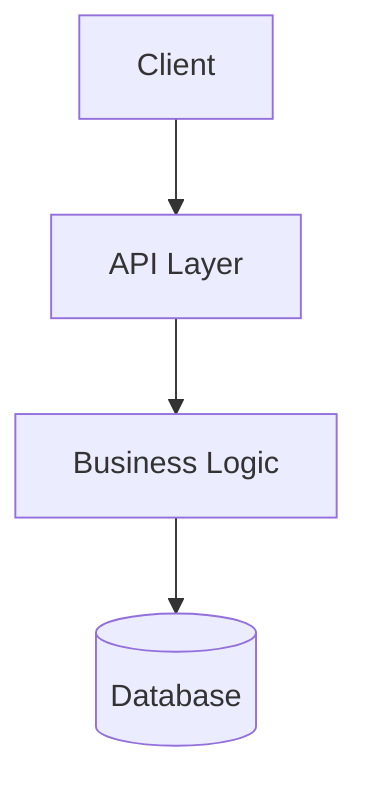
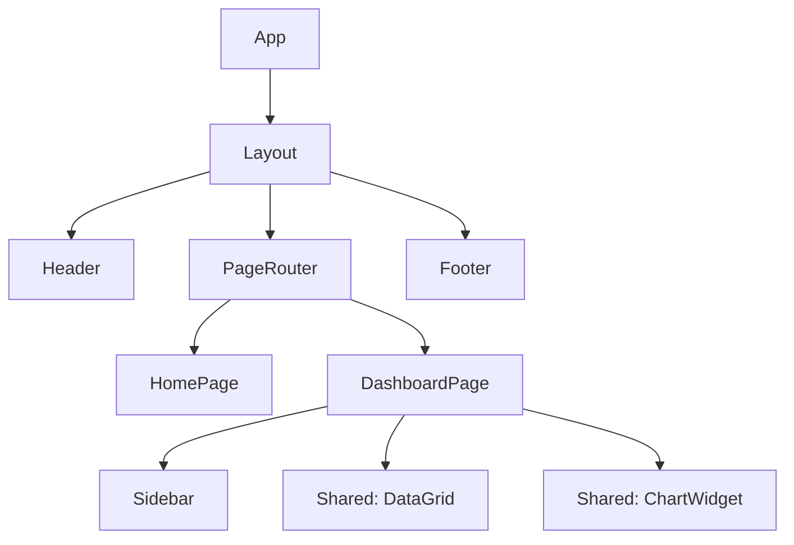

# Document Templates

## .context/CONTEXT.md Template

```markdown
# {Project Name} — Project Context

## Project Overview
{Business domain summary. Not "handles logic" — describe the actual domain, e.g., "Multi-tenant SaaS for municipal tax filing, handling W-2 ingestion and rule-based calculations."}

## Project Type
{Identify: Web App / API Service / CLI Tool / Library/SDK / Mobile App / Data Pipeline / Infrastructure / Monorepo / Desktop App / Embedded / Other}

## High-Level Architecture
> Include only layers that exist in this project. Remove rows that don't apply.

- **Frontend**: {framework/stack — or "N/A" for backend-only / CLI / library projects}
- **Backend API**: {framework/stack — or "N/A" for frontend-only / static sites}
- **CLI / Entry Point**: {if applicable — command parser, subcommands}
- **Core Library**: {if applicable — the public API surface of a library/SDK}
- **Gateway**: {if applicable}
- **Data**: {databases, ORM, per-service or shared}
- **Async / Workers**: {message broker, background jobs, task queues if applicable}
- **Infrastructure**: {Terraform, Ansible, Helm, CDK if applicable}

## Context Navigation Tree
> Master index of all documented modules. Use this to navigate to any module's context docs.

```
.context/                              # Project-level (you are here)
├── CONTEXT.md
├── ARCHITECTURE.md
└── metadata.json

{path}/
├── {module-a}/.context/               # {Short description}
│   ├── CONTEXT.md
│   └── OVERVIEW.md
├── {module-b}/.context/               # {Short description}
│   ├── CONTEXT.md
│   └── OVERVIEW.md
└── {module-c}/                        # (not yet documented)
```

> Modules marked `(not yet documented)` do not have a `.context/` folder yet. Run module-context on them to generate one.

## Module Navigation
> For deep implementation details, check the context file in each module's `.context/` folder.

| Module | Responsibility | Key Tech | Context |
|--------|----------------|----------|---------|
| `{module}` | {responsibility} | {tech} | [Context](./{path}/.context/CONTEXT.md) |

## Development Standards
- **Testing**: {command} ({framework}). Coverage target: {%}.
- **Versioning**: {strategy}
- **Auth Patterns**: {approach}
- **Error Handling**: {pattern}

## Quick Context Snippets
{Things an AI/agent needs to know immediately — ORM, DTO mapping, config strategy, naming conventions, etc.}
```

## .context/ARCHITECTURE.md Template

```markdown
# System Architecture

## Conceptual Diagram
> Adapt this to the actual project type. Examples below — use whichever fits.



## Data Flows

### {Flow Name}
1. {Step}: {description}
2. {Step}: {description}

## Security Design
- **Edge**: {TLS strategy}
- **Service-to-Service**: {mTLS / internal network}
- **Secrets**: {management approach}

## Frontend Architecture (include only for projects with frontend code)

### UI Stack
- **Framework**: {React / Vue / Angular / Svelte / Next.js / Nuxt / ...} v{version}
- **Component Library**: {MUI / Ant Design / Shadcn / Radix / custom / ...}
- **Styling**: {Tailwind / CSS Modules / styled-components / SCSS / ...}
- **State Management**: {Redux / Zustand / Pinia / NgRx / Context / ...}
- **Routing**: {React Router / Next.js App Router / Vue Router / ...}
- **Build Tool**: {Vite / Webpack / Turbopack / ...}

### Component Tree


### Design System
- **Token Source**: `{path to design tokens / theme file}`
- **Shared Components**: `{path to shared component library}`
- **Icons**: {icon system and source}
- **Storybook / Design Docs**: `{path or URL if exists}`

### Frontend Data Flow
1. User interaction triggers event in `{Component}`
2. Event handler dispatches action to `{state store}`
3. State change triggers API call via `{data fetching layer}`
4. Response updates store → React/Vue/Angular re-renders affected components
```

## README.md Template (use only if no README exists or existing one is minimal)

```markdown
# {Project Name}

> {One-line description}

## Contents
{Table of contents}

## Overview
{Human-centric description of what the project does and why it exists.}

## Key Features
{Bullet list of main capabilities}

## Technology Stack
| Layer | Tools / Libraries |
|-------|-------------------|
| {layer} | {tools} |

## Quick Start
```bash
# Step-by-step commands that actually work
```

## Prerequisites
{List required tools with versions}

## Installation & Setup
{Detailed setup instructions}

## Environment Variables
{Table or list of required env vars with descriptions}

## Running the Service
{Dev and prod run commands}

## API Endpoints
{Endpoint table with method, path, description}

## Project Structure
```
{tree output of key directories}
```

## Operational Cheat Sheet
| Task | Command |
|------|---------|
| {task} | `{command}` |
```
